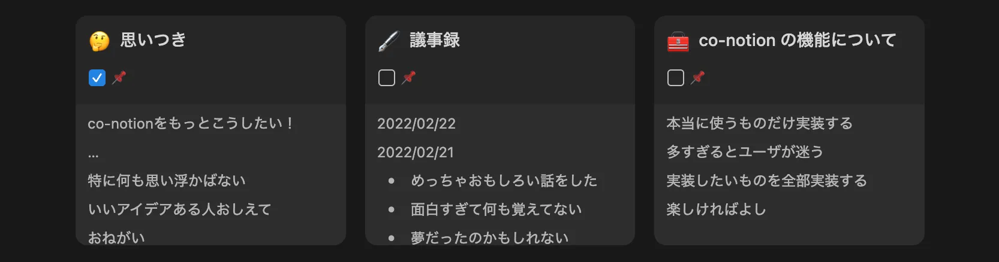
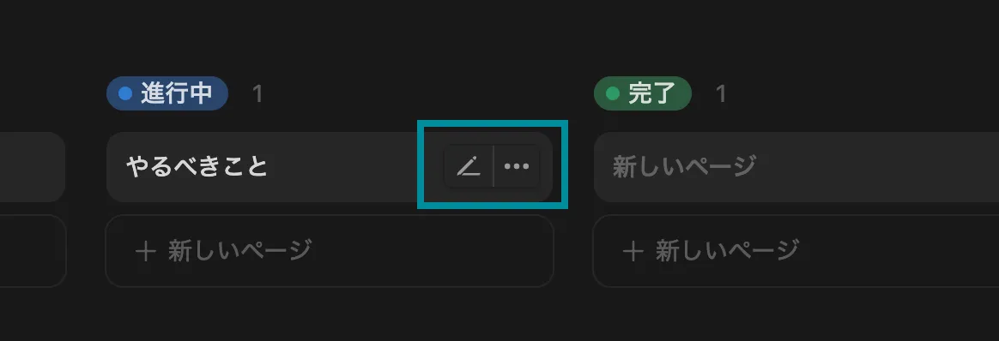
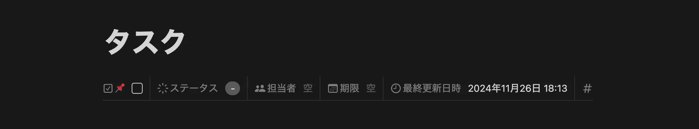

  

  <a href="https://chromewebstore.google.com/detail/co-notion/jmoihmhigfijpobomcdflaeoenkfmpkb">Chrome Web Store</a>

# 機能一覧

## 検索時に自動で現在のチームスペースを指定

ワークスペースの検索時に、自動で現在のチームスペースをフィルタにセットします。「自分がゲストのときは『場所』フィルタを使う」をオンにしておくと、招待されたファイルでは「場所」フィルタを使用します。

### 機能の背景

Notion では、ワークスペース全体を検索できる検索窓を ⌘/Ctrl+P か ⌘/Ctrl+K、もしくは左のサイドバーの「検索」から開くことができます。

デフォルトでは自分がアクセスできるすべてのページからの検索となりますが、ページ数が増えてくると検索結果に関係のないページが入り込み、目的のページを見つける難易度が上がります。

検索では手動でフィルタを設定することができ、検索窓の右にある ≡ ボタンを押すと、

フィルタのリストが出てきて、結果を絞り込むことができます。

自分が今開いているページと関連のあるページを検索したい場合、「チームスペース」フィルタ(自分がゲストの場合は「場所」フィルタ)を設定するとよいですが、毎回手動で設定するのは面倒です。

この機能をオンにしておくと、特定の方法で検索を開いたときに自動でフィルタを設定することができます。

(ワークスペース全体から検索できると便利なことも多いので、両方使えるようにしておくのがおすすめです。)

## 前回の検索条件を復元しない

「検索時に自動で現在のチームスペースを指定」を使用する場合はこちらもオンにしておくことをおすすめします。

Notion では検索終了後、再び検索を開くとフィルタなども含めて前回の検索条件が復元されます。検索条件が復元された場合はフィルタの上書きを行わないので、確実に自動フィルタ設定を機能させたい場合はこちらもあわせてお使いください。

## インラインリンクをアイコンとして表示

特定のデータベース(DB)に属するページへのインラインリンクをアイコンとして表示させることができます。誰かの文章に自分の意見を追記するときなど、発言者を明示したい場合に便利です。

例えば、自己紹介用のDBを作成し、各ページのアイコンにメンバーのプロフィール画像を設定、DBのURLをこちらの機能に登録すると、DB内の自己紹介ファイルへのメンション(インラインリンク)がアイコンとして表示されます。

### 使用方法

まず、DBのURLをビューのタブをクリックして表示される「ビューのリンクをコピー」からコピーします。

そして、この設定の記入欄の1行目に自分がわかりやすいDBの名前を入力し、2行目にDBのURLを貼り付けてください。DB名は Notion で設定されているDBの名前と一致させる必要はありません。

「設定を保存」をクリックすると「(DB名)を読込」と書かれたボタンが表示されるので続いてクリックし、Notion で DB が表示されれば準備は完了です。以降、その時点でDB内にあるファイルへのインラインリンクはアイコンとして表示されます。

DB内に新しいファイルが増えた場合は、設定画面から再び「(DB名)を読込」を実行してください。

データベースは複数登録できます。3行目以降にも同じ書き方で続けて書くことができます。DB名は省略できますが、省略すると画面表示が崩れることがあるので指定することをおすすめします。

### インラインリンクとは

Notion の機能の一つで、文中に他のページへのリンクを挿入することができます。作成方法はいくつかありますが、[[ と入力すると「ページリンクを作成」というポップアップが出てくるので、そこでリンクしたいページ名を入力することで作成できます。

## プロフィールページへのリンクをショートカットで挿入

「インラインリンクをアイコンとして表示」でアイコン表示できるようにした自分のプロフィールページへのリンクを、ショートカットで簡単に作成できるようにします。

「プロフィールページ名」には、アイコンに自分のプロフィール画像が登録してあるプロフィールページのタイトルを入力してください。

デフォルトのショートカットは ⌘/Ctrl+I (アイ) ですが、これはイタリック体の切り替えのショートカットと同じなので、そちらをよく使う方は変更をお願いします。

### 注意

連打すると壊れるので、おしとやかにお使いください。どうしても連打したい場合は、一つ作成したアイコンをコピーして貼り付けを連打することをおすすめします。

## ギャラリービューにピン留め表示を追加

ギャラリービューにチェックボックスのプロパティを作成し、それを並び替えに利用してピン留め機能を再現していることを前提とした機能です。

ギャラリービューにチェックボックスのプロパティを表示し、かつそのプロパティがプロパティの中で一番上に配置されている場合に、チェックの入ったページにピン留めされていることが分かるマーク(タイトル右上に薄い二重線)を表示します。

(画像は「チェックボックスを非表示」をオンにした状態です)

## データベースのメニューバーを常に表示

データベースの右肩に表示されるメニューはマウスカーソルが上にあるときにのみ表示されますが、これを常に表示するようにします。

常に表示すると「新規」の青色が少し目立ちすぎるので、他のメニューと同じ落ち着いた色にそろえています。

## ギャラリービューのプレビューのフォントサイズを揃える

ギャラリービューのプレビュー部分で見出しが大きく表示されると見づらい場合、この機能でフォントサイズを小さくそろえることができます。

### Before

### After

## ギャラリービューのプレビューを下に配置

ギャラリービューのプレビューを一番下に配置します。プレビューに表示されるものが画像ではなく文字中心の場合は、こちらの方が見やすいかもしれません。

### Before

### After

## ギャラリービューのタイトルの長さを制限

ギャラリービューのタイトルは、デフォルトではどれだけ長くても全て表示されます。長すぎるタイトルは余計な余白を生み、全体の見た目を崩してしまうことがあるので、途中までしか表示しないようにします。

### Before

### After

## ギャラリービューのホバーメニューを非表示

ギャラリービューのページにカーソルを合わせたときに出てくるボタンを非表示にします。あまり使わないのに間違えて押してしまう、という方はぜひご利用ください。

## ボードビューのホバーメニューを非表示

ボードビューのページにカーソルを合わせたときに出てくるボタンを非表示にします。使用頻度は高くないけれど間違って押す頻度は高い、という方は奮ってご活用ください。

## 空行に表示されるプレースホルダを非表示

何も記入していない行に表示される、薄いけれど微妙に主張の強い文字を非表示にします。

## 箇条書きなどの階層がわかりやすいように線を表示

Tab キーで字下げをして作成された階層がわかりやすいように、行頭に薄いラインを表示します。

通常のテキスト、箇条書き、順序付きリスト、ToDoリストに対応しています。

## ページのプロパティを1行で表示

プロパティが増えてくると、ページ上部をプロパティの行が圧迫してしまいます。これを防ぐためにプロパティを1行で表示させます。1行になったプロパティは横にスクロールでき、編集、追加なども可能です。(並び替えもできますが、少々やりづらいです)

### Before

### After

## 同期ブロックの境界線を常に表示

同期ブロックの境界線を非選択時にも表示するようにします。同期元ブロックの境界線は赤、同期先ブロックの境界線はグレーで表示します。「境界線をモノクロにする」をオンにすると、同期元ブロックの境界線は濃いグレーになります。

## タブに表示するアイコンを常に同じにする

Notion はページを移動するごとに、タブに表示されるアイコン(ファビコン)をページに設定しているアイコンに変更します。アイコンが変わるとタブ上でNotion を見つけづらくて困る、という人向けの機能です。

## Notion AI を非表示

あちらこちらに表示されるNotion AI を非表示にします。この機能を有効にしても ⌘/Ctrl+J からは起動できますので、必要な場合はそちらからどうぞ。

(この機能はワークスペースのメンバーのみが対象です。ゲストの方は Notion AI が最初から無効になっているので、この機能を使用する必要はありません)

## データベースに新しいページを作成するショートカットを追加

⌘/Ctrl+O (オー) で、現在表示されているデータベース、もしくは現在表示されているページが所属しているデータベースに新しいページを作成します。

データベース内のページを編集していて、内容の一部を新しいページに切り出したい、と思ったときなどに、ショートカット一つで新しいページを作成できて便利です。

## 選択中の画像の整列指定にショートカットを追加

文字入力中ではなく、かつ

画像のオプションが表示されている状態  
(マウスカーソルが乗っている状態)

または

画像を選択した状態  
(画像がうっすら青くなった状態)

で「L・C・R」キーのいずれかを押すと、それぞれ画像を左、中央、右にそろえることができます。

## 文字入力可能なダイアログを Esc 一回で閉じる

文字入力可能なダイアログで Esc キーを押すと、まず入力からフォーカスが外れ、その後にダイアログが閉じる、という動きをします。これが冗長だと感じる場合、機能を有効にすることで Esc 一回でダイアログを閉じることができるようになります。